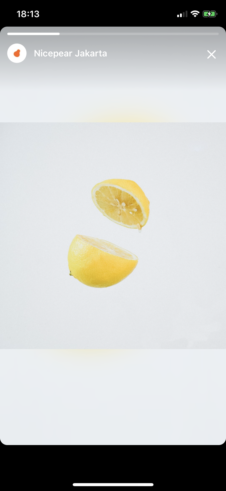

# UnsplashGallery
<h1 align="center">
  

    
    
    
  

</h1>

 

## Description
iOS client for Unsplash(https://unsplash.com/). 

Two screens: feed and full screen viewer. Feed contains two sections: random photos (horizontal scroll) and popular photos (vertical scroll). Application supports pagination and refreshing.
Pagination work only for popular photos. But refreshing content refresh both sections. Tap on cell in random photos sections open full screen viewer, which works like Instgram stories: auto progress, scrolling, pausing and resuming. Tap on cell in popular sections open full screen viewer with only one photo.

## Restrictions
Application is in demo mode and is rate-limited to 50 requests per hour. After this limit, API will send response with error. But application will not show error states.

## Requirements
- iOS 11 or later
- Swift version 5.0
- A Mac with Xcode 11 or later
